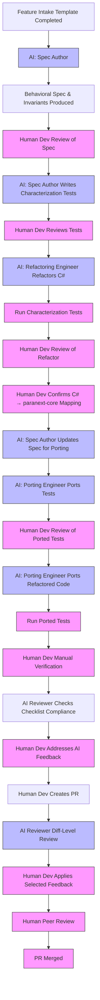

Workflow diagram

```mermaid
flowchart TD
%% Phase 0: Feature Intake
A[Feature Intake Template Completed] --> B[AI: Spec Author]

    %% Phase 1: Specification
    B --> C[Behavioral Spec & Invariants Produced]
    C --> D[Human Dev Review of Spec]

    %% Phase 2: Characterization Tests
    D --> E[AI: Spec Author Writes Characterization Tests]
    E --> F[Human Dev Reviews Tests]

    %% Phase 3: Refactor Legacy C# Code
    F --> G[AI: Refactoring Engineer Refactors C#]
    G --> H[Run Characterization Tests]
    H --> I[Human Dev Review of Refactor]

    %% Phase 4: Port Specification Alignment
    I --> J[Human Dev Confirms C# → paranext-core Mapping]
    J --> K[AI: Spec Author Updates Spec for Porting]

    %% Phase 5: Port Tests
    K --> L[AI: Porting Engineer Ports Tests]
    L --> M[Human Dev Review of Ported Tests]

    %% Phase 6: Port Code
    M --> N[AI: Porting Engineer Ports Refactored Code]
    N --> O[Run Ported Tests]
    O --> P[Human Dev Manual Verification]

    %% Phase 7: Review & Hardening
    P --> Q[AI Reviewer Checks Checklist Compliance]
    Q --> R[Human Dev Addresses AI Feedback]

    %% Phase 8: PR & Merge
    R --> S[Human Dev Creates PR]
    S --> T[AI Reviewer Diff-Level Review]
    T --> U[Human Dev Applies Selected Feedback]
    U --> V[Human Peer Review]
    V --> W[PR Merged]

    %% Annotations
    classDef human fill:#f9f,stroke:#333,stroke-width:1px;
    classDef ai fill:#bbf,stroke:#333,stroke-width:1px;

    class D,F,H,I,J,M,O,P,R,U,V,W human;
    class B,E,G,K,L,N,T ai;
```